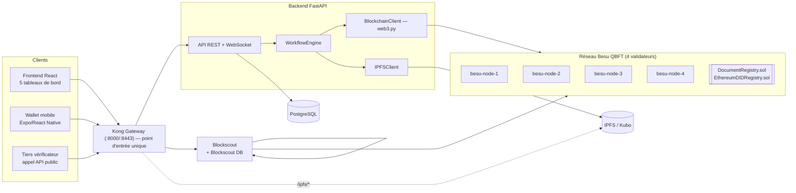
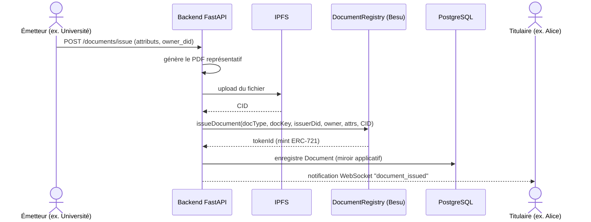
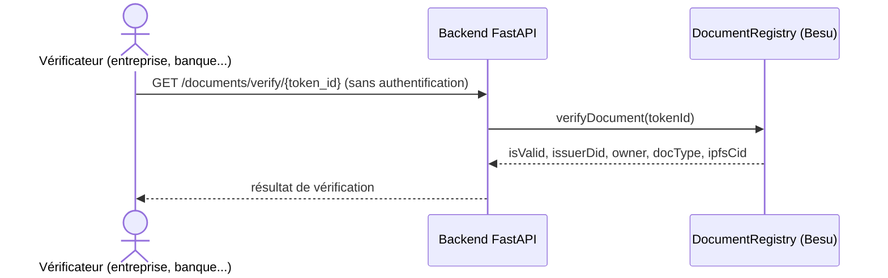
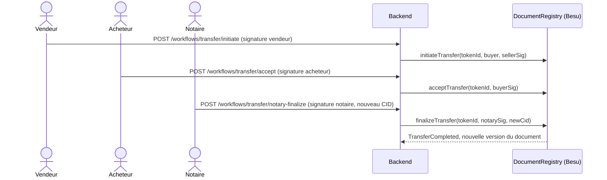

# TrustWedge — Architecture technique

> Document 2/6 de la documentation projet. Voir [docs/README.md](README.md) pour l'index complet.

## 1. Vue d'ensemble

TrustWedge est un monorepo composé de :

- un réseau **blockchain privé** (Hyperledger Besu, 4 validateurs, consensus QBFT) portant deux smart contracts (`DocumentRegistry`, `EthereumDIDRegistry`) ;
- un **backend** FastAPI qui orchestre blockchain, IPFS et PostgreSQL derrière une API REST + WebSocket ;
- un **frontend web** React (5 tableaux de bord, un par rôle) et un **wallet mobile** Expo/React Native ;
- des services d'infrastructure : **IPFS** (stockage fichiers), **Postgres** (état applicatif), **Blockscout** (explorateur de blocs), **Kong** (passerelle API unique) ;
- le tout orchestré en local par **Docker Compose** (11 services).



## 2. Composants Docker Compose

| Service | Rôle | Port hôte | Notes |
|---|---|---|---|
| `besu-node-1..4` | Validateurs QBFT du réseau privé | 30403-30406 (P2P), 127.0.0.1:8645 (RPC, node-1 seulement) | Renommés `trust-besu-node-*`, sous-réseau `172.26.0.0/16` pour éviter les conflits Docker locaux |
| `postgres` | Base applicative | 5442 (interne 5432) | Volume `services/postgres-data` |
| `ipfs` | Nœud IPFS (Kubo) | non exposé directement (via Kong `/ipfs/*`) | Volume `services/ipfs-data` |
| `backend` | API FastAPI | non exposé directement (via Kong `/api/*`) | Monte `services/backend/app` |
| `frontend` | SPA React (build statique servi) | non exposé directement (via Kong `/`) | |
| `blockscout-db` | PostgreSQL dédiée à Blockscout | interne | Volume `services/blockscout-data` |
| `blockscout` | Backend indexeur Blockscout | via Kong (`explorer-api.localhost`) | Lit les blocs Besu en continu |
| `blockscout-frontend` | UI Blockscout | via Kong (`explorer.localhost`) | Image `ghcr.io/blockscout/frontend` (pas sur Docker Hub) |
| `kong-database` | PostgreSQL dédiée à Kong | interne | |
| `kong-migrations` | Migration du schéma Kong (job one-shot) | — | |
| `kong` | Passerelle API | **8000 (HTTP), 8443 (HTTPS)** — seuls ports applicatifs exposés | Certificat auto-signé par défaut |
| `kong-setup` | Déclare les routes/services Kong au démarrage | — | Idempotent, via `scripts/kong-setup.sh` |

> Avant la mise en place de Kong, frontend (3000), backend (8010), IPFS API/gateway (5001/8080) et RPC Besu (8646-8648) étaient exposés directement — ce n'est plus le cas : tout transite par Kong, à l'exception du RPC Besu du node-1 laissé en loopback pour le déploiement Hardhat.

## 3. Réseau blockchain (Besu / QBFT)

- **Consensus** : QBFT (Byzantine Fault Tolerant), 4 nœuds validateurs → tolère la défaillance d'un nœud sans interrompre la production de blocs.
- **Génération du réseau** : `scripts/generate-network.bat` génère les clés de chaque nœud et le fichier `genesis.json` (config réseau : `config/qbftConfigFile.json`).
- **Paramètres réseau** (`.env`) : `BESU_NETWORK_ID`, `BESU_CHAIN_ID`, `BESU_GAS_PRICE`, `BESU_RPC_URL`, `BESU_WS_URL`.
- **Accès RPC** : uniquement `127.0.0.1:8645` (node-1, loopback), utilisé par Hardhat pour le déploiement des contrats. Le backend, lui, s'y connecte en réseau interne Docker.

### 3.1 Smart contract `DocumentRegistry.sol`

Contrat unique (`services/nodes/contrat/DocumentRegistry.sol`) mutualisé pour tous les types de documents, basé sur `ERC721URIStorage` + `AccessControl` (OpenZeppelin) :

- **Rôles** : `ISSUER_ROLE`, `VERIFIER_ROLE`, `NOTARY_ROLE`, `ADMIN_ROLE` (`DEFAULT_ADMIN_ROLE` détenu par le compte de déploiement).
- **Unicité** : par couple (`docType`, `docKey`) *et* par hash de contenu (`ipfsCid` → `hashToTokenId`) — un document ne peut être émis en double, ni un contenu identique réutilisé sous une autre référence.
- **DID émetteur vérifié on-chain** : `issueDocument` exige que l'appelant possède `ISSUER_ROLE` **et** que son adresse corresponde au DID `issuerDid` fourni (`_resolveDidToAddress`).
- **Historique de versions** (`DocumentVersion[]`) : chaque mise à jour de contenu (ex. nouveau titre après transfert) ajoute une version, sans perdre les précédentes ; `getOwnerAtTimestamp` permet de retrouver le propriétaire à une date donnée.
- **Transfert à triple signature** (`initiateTransfer` → `acceptTransfer` → `finalizeTransfer`) : vendeur et acheteur signent hors-chaîne un message `keccak256(tokenId, buyer, chainId)`, le notaire (`NOTARY_ROLE`) finalise et exécute le transfert ERC-721 + enregistre le nouveau CID.
- **Révocation** (`revokeDocument`, réservé à `ISSUER_ROLE`) : désactive un document sans le supprimer (traçabilité conservée).
- **Vérification publique** (`verifyDocument`, `getDocument`, `getAttributes`) : lecture seule, sans contrôle d'accès — c'est la base de la vérification "sans confiance" côté tiers.

### 3.2 Smart contract `EthereumDIDRegistry.sol`

Registre DID standard (ERC-1056) utilisé pour la résolution et la gestion des identités décentralisées des utilisateurs (`did:ethr:0x...`).

## 4. Backend (FastAPI)

Arborescence (`services/backend/app/`) :

```
main.py                 # point d'entrée FastAPI, routes historiques (auth, documents, workflows, users), WebSocket
auth.py                 # register_user / login_user / get_current_user (JWT)
blockchain.py           # BlockchainClient — encapsule web3.py, ABI du contrat
ipfs_utils.py           # IPFSClient — appels HTTP directs à l'API Kubo (pas de lib ipfshttpclient, abandonnée)
workflow_engine.py      # WorkflowEngine — machine à états des workflows métier
event_bus.py            # bus WebSocket pour les notifications temps réel
database.py, models.py, schemas.py
routers/                # actors, admin, did, disclosure, documents, kyc, notifications, shares, stats, transfers, verification
services/
  did_service.py            # génération/chiffrement des clés DID par utilisateur
  ocr_service.py            # OCR générique
  id_card_ocr_service.py    # OCR carte d'identité (KYC)
  face_match_service.py     # correspondance faciale (KYC)
  signature_service.py      # signatures hors-chaîne (transferts)
  pdf_generator.py          # génération des PDF de documents/titres
  notification_service.py   # notifications applicatives
contracts/DocumentRegistry.abi.json
```

### 4.1 Table des routes par domaine

| Préfixe | Routeur | Domaine |
|---|---|---|
| `/auth`, `/documents`, `/workflows`, `/users`, `/ws` | `main.py` | Auth, émission/vérification document, cycle de workflow, WebSocket |
| `/actors` | `actors.py` | Création d'un utilisateur géré (`create-managed-user`) |
| `/admin` | `admin.py` | Création d'acteurs institutionnels, gestion des titres fonciers, vues admin documents/workflows |
| *(sans préfixe)* `/did/*` | `did.py` | Consultation/régénération DID |
| `/documents` (2ᵉ routeur) | `disclosure.py` | Vérification de divulgation sélective |
| `/verification/kyc` | `kyc.py` | Soumission et revue KYC |
| `/notifications` | `notifications.py` | File de notifications utilisateur |
| `/shares` | `shares.py` | Liens de partage de documents |
| *(sans préfixe)* `/stats/*`, `/network/status` | `stats.py` | Indicateurs plateforme et santé réseau |
| `/workflows/transfer` | `transfers.py` | Transfert à triple signature |
| `/verification` | `verification.py` | OTP téléphone/email, OCR carte, correspondance faciale |

Détail fonctionnel de chaque endpoint : voir [01-SPECIFICATIONS.md](01-SPECIFICATIONS.md) §4. Documentation interactive : `http://localhost:8000/api/docs` (Swagger, une fois la stack lancée).

### 4.2 Authentification et autorisation

- JWT émis par `/auth/login`, vérifié par `get_current_user` (dépendance FastAPI) sur les routes protégées.
- Autorisation à deux niveaux : rôle applicatif (`UserRole`, vérifié en Python) **et** rôle on-chain (`AccessControl` du contrat, vérifié par le contrat lui-même à l'exécution de la transaction) — la seconde couche ne peut pas être contournée même si la première l'était.
- Voir les limitations de sécurité assumées du MVP : [01-SPECIFICATIONS.md](01-SPECIFICATIONS.md) §7.

## 5. Base de données (PostgreSQL)

Schéma géré par SQLAlchemy (`models.py`, créé automatiquement au démarrage — pas de migration Alembic à ce stade). Entités : `User`, `Document`, `Invitation`, `Workflow` / `WorkflowStep`, `DocumentShare`, `KycVerification`, `Notification`. Le `Document` applicatif est un **miroir** du NFT on-chain (source de vérité = la blockchain ; la base sert à l'indexation/consultation rapide côté API).

## 6. Stockage de fichiers (IPFS)

- Upload via `IPFSClient` → appels HTTP directs à l'API Kubo (`/api/v0/add`, etc.), sans la librairie `ipfshttpclient` (abandonnée depuis 2020, incompatible avec les versions récentes de Kubo).
- Le CID retourné est stocké on-chain (`Document.ipfsCid`) — le fichier est donc adressé par son contenu, et toute modification produit un nouveau CID (nouvelle version).
- Accès public en lecture via Kong (`/ipfs/*` → passerelle IPFS).

## 7. Passerelle Kong

Point d'entrée unique de l'application (`http://localhost:8000` / `https://localhost:8443`) :

- **Routage par chemin** : `/` → frontend React (SPA), `/api/*` → backend (préfixe retiré avant transmission), `/ws/*` → WebSocket backend, `/ipfs/*` → passerelle IPFS. Kong priorise automatiquement les chemins les plus spécifiques (pas de conflit avec le catch-all `/`).
- **Routage par nom d'hôte** pour Blockscout (`explorer.localhost`, `explorer-api.localhost`) — l'app Next.js de Blockscout référence ses assets en chemin absolu, un préfixe de chemin les casserait.
- **Configuration déclarative** : `scripts/kong-setup.sh`, exécuté au démarrage par `kong-setup` (idempotent).
- **CORS et rate limiting** (300 req/min) centralisés au niveau de la passerelle. Les origines CORS et les routes Blockscout (§ suivante) sont paramétrées par la variable `DEPLOY_HOST` (`.env`) — voir [04-DEPLOIEMENT-PRODUCTION.md](04-DEPLOIEMENT-PRODUCTION.md) §2bis pour un déploiement par IP sans nom de domaine.
- **Kong Admin API (8001) et Kong Manager (8002) non publiés** vers l'hôte — pas d'authentification native en édition Community, donc pas d'exposition. Accès ponctuel : `docker exec -it trust-kong curl http://localhost:8001/...`.
- **Authentification applicative non dupliquée dans Kong** : le JWT métier reste géré par le backend (`/auth/login`) — volontairement pas de plugin `jwt`/`key-auth` Kong superposé, pour éviter deux systèmes d'authentification divergents.

## 8. Frontend web (React)

Arborescence (`services/frontend/src/`) :

```
App.js                          # routage principal
context/AuthContext.js          # session utilisateur
context/NotificationsContext.js # état des notifications (couplé au WebSocket)
hooks/useWebSocket.js, useNotifications.js, useLiveRefresh.js
pages/dashboards/                # un tableau de bord par rôle
pages/admin/, citizen/, forms/, generic/, lists/
pages/Login.js, DocumentHistory.js, TransferSign.js, Profile.js, NotificationsPage.js
components/IssueDocumentForm.js, DocumentVerifyPanel.js, PendingVerificationsPanel.js, QrScanDialog.js
services/api.js, adminApi.js     # client HTTP vers le backend (via Kong)
theme/roleThemes.js, docTypeLabels.js, iconMap.js
```

5 routes de tableau de bord, une par rôle de test : `/university`, `/alice`, `/company`, `/bank`, `/state` (voir comptes de test dans le [README](../README.md)).

## 9. Wallet mobile (Expo / React Native)

`apps/wallet/` — application mobile du citoyen (React Native, Expo). Consomme `packages/sdk` (client API/blockchain partagé) et `packages/shared` (types partagés avec le frontend web). Fonctions clés : réception de VC, QR code de partage, parcours KYC (OTP, OCR carte, selfie). Détail : [WALLET.md](WALLET.md).

## 10. Flux de données — séquences clés

### 10.1 Émission d'un document



### 10.2 Vérification publique



### 10.3 Transfert de titre foncier (triple signature)



Cycle de workflow métier complet (5 types) : voir [03-WORKFLOW.md](03-WORKFLOW.md).

## 11. Répertoire du code source

```
services/backend       # API FastAPI
services/nodes          # contrats Solidity, scripts Hardhat, données/clés des nœuds Besu
services/frontend       # application React
services/postgres-data, ipfs-data, blockscout-data, kong-data   # volumes persistants
config                  # configuration réseau QBFT générée
scripts                 # scripts d'initialisation (génération réseau, Kong)
apps/wallet             # wallet mobile Expo/React Native
packages/shared, sdk    # code partagé entre wallet et (à terme) frontend web
docker-compose.yml
genesis.json
```
