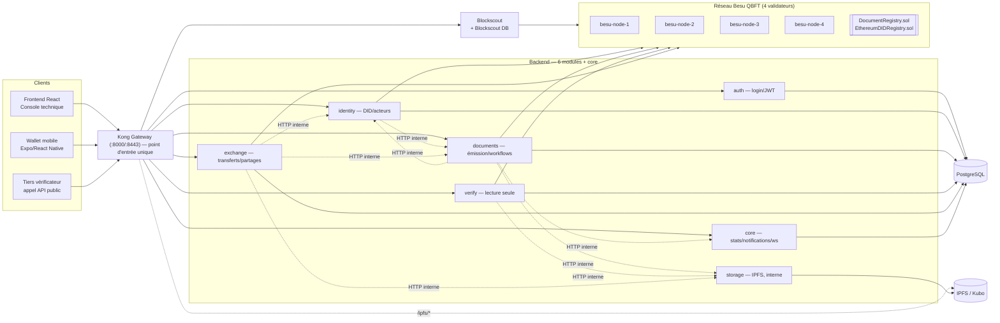
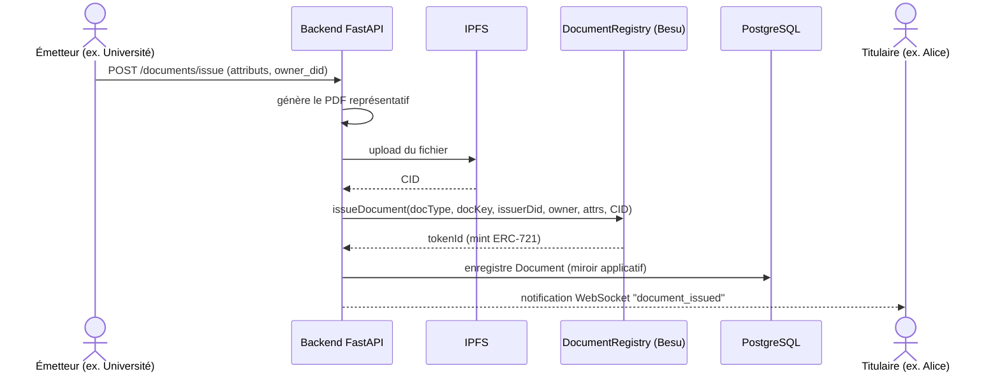
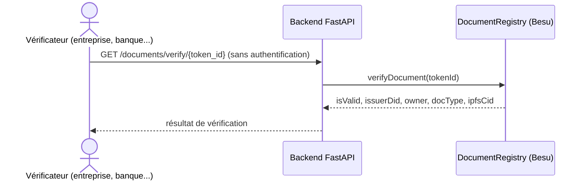
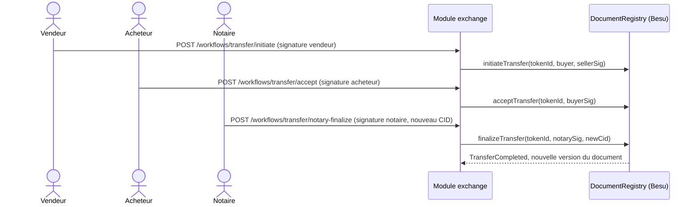

# TrustWedge — Architecture technique

> Document 2/11 de la documentation projet. Voir [docs/README.md](README.md) pour l'index complet.

## 1. Vue d'ensemble

TrustWedge est un monorepo composé de :

- un réseau **blockchain privé** (Hyperledger Besu, 4 validateurs, consensus QBFT) portant deux smart contracts (`DocumentRegistry`, `EthereumDIDRegistry`) ;
- un **backend découpé en 6 modules FastAPI indépendants** (`auth`, `identity`, `documents`, `verify`, `storage`, `exchange`) + un service **core** résiduel (statistiques, notifications, WebSocket, annuaire) — voir §4 ;
- une **bibliothèque d'authentification partagée** (`packages/backend-shared/trustwedge_auth`) : un seul système d'auth (JWT + hash de mot de passe), distribué entre les modules plutôt que dupliqué — `auth` est l'unique émetteur de JWT, les 5 autres modules valident le même token avec le même secret ;
- un **frontend web** React (une Console technique commune à tous les rôles + les actions propres à chaque rôle) et un **wallet mobile** Expo/React Native ;
- des services d'infrastructure : **IPFS** (stockage fichiers, derrière le module `storage`), **Postgres** (état applicatif, partagé par les modules backend), **Blockscout** (explorateur de blocs), **Kong** (passerelle API unique) ;
- le tout orchestré en local par **Docker Compose** (18 services).


```mermaid
flowchart LR
    subgraph Clients
        WEB[Frontend React<br/>Console technique]
        MOB[Wallet mobile<br/>Expo/React Native]
        EXT[Tiers vérificateur<br/>appel API public]
    end

    subgraph Kong["Kong Gateway (:8000/:8443) — point d'entrée unique"]
    end

    subgraph BE["Backend — 6 modules + core"]
        AUTH[auth — login/JWT]
        ID[identity — DID/acteurs]
        DOC[documents — émission/workflows]
        VER[verify — lecture seule]
        STO[storage — IPFS, interne]
        EXC[exchange — transferts/partages]
        CORE[core — stats/notifications/ws]
    end

    PG[(PostgreSQL)]
    IPFS[(IPFS / Kubo)]
    BSC[Blockscout<br/>+ Blockscout DB]

    subgraph Besu["Réseau Besu QBFT (4 validateurs)"]
        N1[besu-node-1]
        N2[besu-node-2]
        N3[besu-node-3]
        N4[besu-node-4]
        SC[[DocumentRegistry.sol<br/>EthereumDIDRegistry.sol]]
    end

    WEB --> Kong
    MOB --> Kong
    EXT --> Kong
    Kong --> AUTH & ID & DOC & VER & EXC & CORE
    Kong --> BSC
    Kong -.->|/ipfs/*| IPFS

    ID -.->|HTTP interne| DOC
    DOC -.->|HTTP interne| ID
    EXC -.->|HTTP interne| DOC & ID
    DOC & VER & EXC -.->|HTTP interne| STO
    DOC -.->|HTTP interne| CORE

    AUTH & ID & DOC & VER & EXC & CORE --> PG
    STO --> IPFS
    ID & DOC & VER & EXC --> Besu
    BSC --> Besu
```

## 2. Composants Docker Compose

| Service | Rôle | Port hôte | Notes |
|---|---|---|---|
| `besu-node-1..4` | Validateurs QBFT du réseau privé | 30403-30406 (P2P), 127.0.0.1:8645 (RPC, node-1 seulement) | Renommés `trust-besu-node-*`, sous-réseau `172.26.0.0/16` pour éviter les conflits Docker locaux |
| `postgres` | Base applicative | 5442 (interne 5432) | Volume `services/postgres-data` |
| `ipfs` | Nœud IPFS (Kubo) | non exposé directement (via Kong `/ipfs/*`) | Volume `services/ipfs-data` |
| `backend` | Module **core** : stats, notifications, WebSocket, annuaire `/users` | non exposé directement (via Kong `/api/*`, catch-all) | Monte `services/backend/app` — dépôt historique, réduit lors du découpage (voir §4) |
| `auth` | Module **auth** : inscription/connexion, émission JWT | via Kong (`/api/auth/*`) | Seul émetteur de JWT |
| `identity` | Module **identity** : création d'acteurs, DID, rôles on-chain | via Kong (`/api/admin/actors/*`, `/api/actors/*`, `/api/did/*`) | Appelle `documents` (émission carte d'identité) et `storage` en interne |
| `documents` | Module **documents** : émission, workflows métier, vérification, divulgation, KYC | via Kong (`/api/documents/*`, `/api/workflows/*`, `/api/verification/*`) | Détient `workflow_engine.py` et les clés de signature |
| `verify` | Module **verify** : vérification publique lecture seule | via Kong (`/api/documents/verify/*`) | Aucune clé de signature — lecture seule |
| `storage` | Module **storage** : wrapper IPFS, interne uniquement | non exposé via Kong (appelé en HTTP interne par `documents`/`verify`/`exchange`) | Sans authentification — réseau Docker interne uniquement |
| `exchange` | Module **exchange** : transferts, partages, divulgation entre parties | via Kong (`/api/workflows/transfer/*`, `/api/shares/*`) | Appelle `documents`/`identity`/`storage` en interne |
| `frontend` | SPA React (build statique servi) | non exposé directement (via Kong `/`) | |
| `blockscout-db` | PostgreSQL dédiée à Blockscout | interne | Volume `services/blockscout-data` |
| `blockscout` | Backend indexeur Blockscout | via Kong (`explorer-api.localhost`) | Lit les blocs Besu en continu |
| `blockscout-frontend` | UI Blockscout | via Kong (`explorer.localhost`) | Image `ghcr.io/blockscout/frontend` (pas sur Docker Hub) |
| `kong-database` | PostgreSQL dédiée à Kong | interne | |
| `kong-migrations` | Migration du schéma Kong (job one-shot) | — | |
| `kong` | Passerelle API | **8000 (HTTP), 8443 (HTTPS)** — seuls ports applicatifs exposés | Certificat auto-signé par défaut |
| `kong-setup` | Déclare les routes/services Kong au démarrage | — | Idempotent, via `scripts/kong-setup.sh` |

> Avant la mise en place de Kong, frontend (3000), backend (8010), IPFS API/gateway (5001/8080) et RPC Besu (8646-8648) étaient exposés directement — ce n'est plus le cas : tout transite par Kong, à l'exception du RPC Besu du node-1 laissé en loopback pour le déploiement Hardhat.

## 3. Réseau blockchain (Besu / QBFT)

- **Consensus** : QBFT (Byzantine Fault Tolerant), 4 nœuds validateurs → tolère la défaillance d'un nœud sans interrompre la production de blocs.
- **Génération du réseau** : `scripts/generate-network.bat` génère les clés de chaque nœud et le fichier `genesis.json` (config réseau : `config/qbftConfigFile.json`).
- **Paramètres réseau** (`.env`) : `BESU_NETWORK_ID`, `BESU_CHAIN_ID`, `BESU_GAS_PRICE`, `BESU_RPC_URL`, `BESU_WS_URL`.
- **Accès RPC** : uniquement `127.0.0.1:8645` (node-1, loopback), utilisé par Hardhat pour le déploiement des contrats. Le backend, lui, s'y connecte en réseau interne Docker.

### 3.1 Smart contract `DocumentRegistry.sol`

Contrat unique (`services/nodes/contrat/DocumentRegistry.sol`) mutualisé pour tous les types de documents, basé sur `ERC721URIStorage` + `AccessControl` (OpenZeppelin) :

- **Rôles** : `ISSUER_ROLE`, `VERIFIER_ROLE`, `NOTARY_ROLE`, `ADMIN_ROLE` (`DEFAULT_ADMIN_ROLE` détenu par le compte de déploiement).
- **Unicité** : par couple (`docType`, `docKey`) *et* par hash de contenu (`ipfsCid` → `hashToTokenId`) — un document ne peut être émis en double, ni un contenu identique réutilisé sous une autre référence.
- **DID émetteur vérifié on-chain** : `issueDocument` exige que l'appelant possède `ISSUER_ROLE` **et** que son adresse corresponde au DID `issuerDid` fourni (`_resolveDidToAddress`).
- **Historique de versions** (`DocumentVersion[]`) : chaque mise à jour de contenu (ex. nouveau titre après transfert) ajoute une version, sans perdre les précédentes ; `getOwnerAtTimestamp` permet de retrouver le propriétaire à une date donnée.
- **Transfert à triple signature** (`initiateTransfer` → `acceptTransfer` → `finalizeTransfer`) : vendeur et acheteur signent hors-chaîne un message `keccak256(tokenId, buyer, chainId)`, le notaire (`NOTARY_ROLE`) finalise et exécute le transfert ERC-721 + enregistre le nouveau CID.
- **Révocation** (`revokeDocument`, réservé à `ISSUER_ROLE`) : désactive un document sans le supprimer (traçabilité conservée).
- **Vérification publique** (`verifyDocument`, `getDocument`, `getAttributes`) : lecture seule, sans contrôle d'accès — c'est la base de la vérification "sans confiance" côté tiers.

### 3.2 Smart contract `EthereumDIDRegistry.sol`

Registre DID standard (ERC-1056) utilisé pour la résolution et la gestion des identités décentralisées des utilisateurs (`did:ethr:0x...`).

## 4. Backend — 6 modules FastAPI + bibliothèque partagée

Le backend, historiquement un unique service FastAPI (`services/backend`), a été scindé en **6 modules indépendamment déployables** (chacun son `Dockerfile`, son `requirements.txt`, sa propre app FastAPI) plus un service **core** résiduel qui conserve l'ancien code non redistribué. Objectif : déploiement/scaling indépendant par domaine, **sans dupliquer l'authentification** — voir §4.1.

```
packages/backend-shared/trustwedge_auth/   # bibliothèque d'auth partagée (pip-installable)
  security.py      # get_password_hash / verify_password (bcrypt via passlib)
  pii.py           # hash_national_id — SHA-256 des identifiants sensibles
  models.py        # AuthUser — projection minimale de la table users (id, email, hashed_password, role, address, is_active)
  db.py            # session SQLAlchemy paresseuse, DATABASE_URL
  jwt_utils.py      # create_access_token, decode_access_token, get_current_user, get_current_admin

services/auth/app/        # inscription, connexion, émission JWT (seul émetteur)
services/identity/app/    # création d'acteurs, DID, attribution des rôles on-chain
  routers/admin.py, actors.py, did.py, internal.py
  documents_client.py, storage_client.py   # appels HTTP internes
services/documents/app/   # émission de documents, workflows métier, vérification, divulgation, KYC
  workflow_engine.py       # machine à états — détient les clés de signature
  routers/internal.py      # /internal/documents/issue-id-card, /{token_id}/status, /{token_id}/mark-transferred
services/verify/app/      # vérification publique — lecture seule, aucune clé de signature
services/storage/app/     # wrapper IPFS — /internal/storage/*, appelé uniquement par les autres modules
services/exchange/app/    # transferts (triple signature), partages, divulgation entre parties
  routers/transfers.py, shares.py, disclosure.py

services/backend/app/     # module core (résiduel)
  main.py                  # /health, /ws/{user_id}, /internal/notify, /internal/push, /users
  routers/kyc.py, verification.py, stats.py, notifications.py
  services/                # ocr_service.py, id_card_ocr_service.py, face_match_service.py, pdf_generator.py, ...
  blockchain.py, database.py, models.py, schemas.py
```

### 4.1 Authentification — une seule fois, partagée

- `services/auth` est le **seul** service qui vérifie un mot de passe et émette un JWT (`POST /api/auth/login`, `POST /api/auth/register`) — bcrypt via `trustwedge_auth.security`.
- Les 5 autres modules (`identity`, `documents`, `verify`, `exchange`, `backend`/core) **valident** ce même JWT avec le même secret (`JWT_SECRET`), via `trustwedge_auth.jwt_utils.get_current_user` — aucun ne réémet ni ne revérifie de mot de passe. C'est la contrainte explicite du découpage : « un seul système d'authentification, distribué, pas dupliqué ».
- Chaque module a sa propre copie SQLAlchemy des tables dont il a besoin (`models.py` par service), toutes connectées à la **même base Postgres** — ce n'est pas une isolation stricte par base de données, mais une projection de modèles par service ; voir §5.
- Autorisation à deux niveaux, inchangée : rôle applicatif (`UserRole`, vérifié en Python) **et** rôle on-chain (`AccessControl` du contrat, vérifié par le contrat lui-même à l'exécution de la transaction) — la seconde couche ne peut pas être contournée même si la première l'était.

### 4.2 Appels HTTP inter-services (intégration)

Les points d'intégration explicitement identifiés utilisent un appel HTTP interne (non exposé via Kong, réseau Docker interne uniquement) plutôt qu'un accès direct à la base d'un autre module :

| Appel | Déclenché par | Utilisé pour |
|---|---|---|
| `GET /internal/identity/by-address` | `documents` | Résoudre un DID/adresse en identité (nom, rôle) lors de l'émission |
| `POST /internal/documents/issue-id-card` | `identity` | Émettre automatiquement la carte d'identité numérique d'un nouvel acteur |
| `GET /internal/documents/{id}/status`, `POST /internal/documents/{id}/mark-transferred` | `exchange` | Vérifier/mettre à jour l'état d'un document lors d'un transfert |
| `POST /internal/storage/upload`, `/upload-and-pin`, `/hash`, `GET /internal/storage/file/{cid}` | `documents`, `verify`, `exchange` | Upload/lecture IPFS mutualisés (le module `storage` est le seul à parler à IPFS) |
| `POST /internal/notify`, `POST /internal/push` | `documents` | Déclencher une notification applicative / WebSocket portée par le module core |

Compromis assumé : au-delà de ces points nommés, certaines lectures annexes (ex. recherche d'un notaire par rôle, déchiffrement d'une clé privée pour signature locale) restent un accès direct à la base par le module concerné plutôt qu'un aller-retour HTTP systématique — documenté ici comme simplification du MVP, pas comme isolation stricte.

### 4.3 Table des routes par domaine

| Préfixe (via Kong, `/api/...`) | Module | Domaine |
|---|---|---|
| `/api/auth/*` | `auth` | Inscription, connexion, JWT |
| `/api/admin/actors/*`, `/api/actors/*`, `/api/did/*` | `identity` | Création d'acteurs, DID, rôles on-chain |
| `/api/documents/*` (hors `/verify`), `/api/workflows/*` (hors `/transfer`), `/api/verification/*` | `documents` | Émission, cycle de workflow, KYC, divulgation |
| `/api/documents/verify/*` | `verify` | Vérification publique, lecture seule |
| `/api/workflows/transfer/*`, `/api/shares/*` | `exchange` | Transfert triple signature, partages |
| `/api`, `/ws/*` (catch-all restant) | `backend` (core) | Stats, notifications, WebSocket, `/users` |

Détail fonctionnel de chaque endpoint : voir [01-SPECIFICATIONS.md](01-SPECIFICATIONS.md) §4. Routage Kong précis (gestion des chevauchements de chemins) : voir §7. Documentation interactive par module : `http://localhost:8000/api/docs` reste servi par le module core ; chaque module expose aussi son propre `/docs` en interne.

## 5. Base de données (PostgreSQL)

Une **seule base Postgres partagée** par tous les modules backend (`auth`, `identity`, `documents`, `verify`, `exchange`, `backend`/core) — ce n'est pas une base par service. Chaque module possède néanmoins sa **propre copie SQLAlchemy** (`models.py`) des tables dont il a besoin, projetées sur les mêmes tables physiques (schéma créé automatiquement au démarrage — pas de migration Alembic à ce stade). Entités : `User`, `Document`, `Invitation`, `Workflow` / `WorkflowStep`, `DocumentShare`, `KycVerification`, `Notification`. Le `Document` applicatif est un **miroir** du NFT on-chain (source de vérité = la blockchain ; la base sert à l'indexation/consultation rapide côté API).

> Limite assumée du MVP : deux copies de `models.py` (ex. `identity` et `documents`) doivent rester alignées à la main sur les colonnes qu'elles partagent (ex. l'ajout des valeurs `WorkflowType.EMPLOYMENT_VERIFICATION`/`DIPLOMA_VERIFICATION` doit être répercuté dans les 4 copies qui déclarent cet enum). Une vraie isolation par base de données par service n'a pas été retenue pour ce MVP, au profit d'un partage direct plus simple à opérer.

## 6. Stockage de fichiers (IPFS)

- Upload via `IPFSClient` → appels HTTP directs à l'API Kubo (`/api/v0/add`, etc.), sans la librairie `ipfshttpclient` (abandonnée depuis 2020, incompatible avec les versions récentes de Kubo).
- Le CID retourné est stocké on-chain (`Document.ipfsCid`) — le fichier est donc adressé par son contenu, et toute modification produit un nouveau CID (nouvelle version).
- Accès public en lecture via Kong (`/ipfs/*` → passerelle IPFS).

## 7. Passerelle Kong

Point d'entrée unique de l'application (`http://localhost:8000` / `https://localhost:8443`), qui route désormais vers **7 services backend** (6 modules + core) plutôt qu'un seul :

- **Routage par chemin, granulaire par module** (`strip_path: false` sur les routes des nouveaux modules — chacun monte ses routeurs FastAPI avec un préfixe interne `/api`, contrairement à l'ancienne route catch-all `backend-api-route` qui, elle, retire le préfixe `strip_path: true`) :
  - `/api/auth/*` → `auth`
  - `/api/admin/actors/*`, `/api/actors/*`, `/api/did/*` → `identity`
  - `/api/documents/verify/*` (+ variante regex pour les chemins scoping un `token_id`) → `verify` — route **plus spécifique** que `/api/documents/*`
  - `/api/documents/*` (émission, KYC, divulgation), `/api/workflows/*` (hors `/transfer`) → `documents`
  - `/api/workflows/transfer/*`, `/api/shares/*`, `/api/documents/verify-shared` → `exchange`
  - `/api/*` (catch-all restant, `strip_path: true`) → `backend` (core) — stats, notifications, `/users`
  - `/` → frontend React (SPA), `/ws/*` → WebSocket (core), `/ipfs/*` → passerelle IPFS
  - Kong résout les chevauchements par **priorité au préfixe le plus long/spécifique** (ex. `/api/workflows/transfer` gagne sur `/api/workflows`, `/api/documents/verify-shared` gagne sur `/api/documents/verify`) — comportement vérifié en test, sans configuration de priorité explicite nécessaire.
- **Routage par nom d'hôte** pour Blockscout (`explorer.localhost`, `explorer-api.localhost`) — l'app Next.js de Blockscout référence ses assets en chemin absolu, un préfixe de chemin les casserait.
- **Configuration déclarative** : `scripts/kong-setup.sh`, exécuté au démarrage par `kong-setup` (idempotent) — une entrée `service` + `route` par module.
- **CORS et rate limiting** (300 req/min) centralisés au niveau de la passerelle. Les origines CORS et les routes Blockscout (§ suivante) sont paramétrées par la variable `DEPLOY_HOST` (`.env`) — voir [04-DEPLOIEMENT-PRODUCTION.md](04-DEPLOIEMENT-PRODUCTION.md) §2bis pour un déploiement par IP sans nom de domaine.
- **Kong Admin API (8001) et Kong Manager (8002) non publiés** vers l'hôte — pas d'authentification native en édition Community, donc pas d'exposition. Accès ponctuel : `docker exec -it trust-kong curl http://localhost:8001/...`.
- **Authentification applicative non dupliquée dans Kong** : le JWT métier reste géré exclusivement par le module `auth` (§4.1) — volontairement pas de plugin `jwt`/`key-auth` Kong superposé, pour éviter deux systèmes d'authentification divergents. Les internes `/internal/*` de chaque module ne sont **pas** routés par Kong — accessibles uniquement en réseau Docker interne.

## 8. Frontend web (React)

Arborescence (`services/frontend/src/`) :

```
App.js                          # routage principal
context/AuthContext.js          # session utilisateur
context/NotificationsContext.js # état des notifications (couplé au WebSocket)
hooks/useWebSocket.js, useNotifications.js, useLiveRefresh.js
layout/DashboardShell.js         # Console technique — coquille commune (sidebar + contenu), pilotée par theme/roleThemes.js
pages/admin/, citizen/, forms/, generic/, lists/
pages/citizen/MyDocumentsPage.js # tous les documents du citoyen, regroupés par type
pages/Login.js, DocumentHistory.js, TransferSign.js, Profile.js, NotificationsPage.js
pages/generic/KycReviewPage.js   # revue des demandes KYC (banque, état)
pages/citizen/RequestVerificationPage.js  # demande de vérification (citoyen)
components/IssueDocumentForm.js, DocumentVerifyPanel.js, PendingVerificationsPanel.js, QrScanDialog.js
services/api.js, adminApi.js     # client HTTP vers le backend (via Kong)
theme/roleThemes.js, docTypeLabels.js, iconMap.js
```

Les anciens tableaux de bord dédiés par rôle (un par route, `/university`, `/alice`, `/company`, `/bank`, `/state`) ont été remplacés par une **Console technique commune** : une seule coquille (`DashboardShell.js`) pilotée par un menu latéral dont les entrées varient selon le rôle connecté (`theme/roleThemes.js`), plutôt que 5 composants de page séparés. Chaque rôle garde ses pages/actions propres (ex. citoyen : "Mes documents", "Demander une vérification" ; banque/état : "Demandes KYC"/"Vérifications") — voir comptes de test dans le [README](../README.md) et détail des parcours dans [06-GUIDE-UTILISATION.md](06-GUIDE-UTILISATION.md).

## 9. Wallet mobile (Expo / React Native)

`apps/wallet/` — application mobile du citoyen (React Native, Expo). Consomme `packages/sdk` (client API/blockchain partagé) et `packages/shared` (types partagés avec le frontend web). Fonctions clés : réception de VC, QR code de partage, parcours KYC (OTP, OCR carte, selfie). Détail : [WALLET.md](WALLET.md).

## 10. Flux de données — séquences clés

### 10.1 Émission d'un document


```mermaid
sequenceDiagram
    actor Issuer as Émetteur (ex. Université)
    participant API as Backend FastAPI
    participant IPFS
    participant Chain as DocumentRegistry (Besu)
    participant DB as PostgreSQL
    actor Owner as Titulaire (ex. Alice)

    Issuer->>API: POST /documents/issue (attributs, owner_did)
    API->>API: génère le PDF représentatif
    API->>IPFS: upload du fichier
    IPFS-->>API: CID
    API->>Chain: issueDocument(docType, docKey, issuerDid, owner, attrs, CID)
    Chain-->>API: tokenId (mint ERC-721)
    API->>DB: enregistre Document (miroir applicatif)
    API-->>Owner: notification WebSocket "document_issued"
```

### 10.2 Vérification publique


```mermaid
sequenceDiagram
    actor Tiers as Vérificateur (entreprise, banque...)
    participant API as Backend FastAPI
    participant Chain as DocumentRegistry (Besu)

    Tiers->>API: GET /documents/verify/{token_id}  (sans authentification)
    API->>Chain: verifyDocument(tokenId)
    Chain-->>API: isValid, issuerDid, owner, docType, ipfsCid
    API-->>Tiers: résultat de vérification
```

### 10.3 Transfert de titre foncier (triple signature)


```mermaid
sequenceDiagram
    actor Seller as Vendeur
    actor Buyer as Acheteur
    actor Notary as Notaire
    participant API as Module exchange
    participant Chain as DocumentRegistry (Besu)

    Seller->>API: POST /workflows/transfer/initiate (signature vendeur)
    API->>Chain: initiateTransfer(tokenId, buyer, sellerSig)
    Buyer->>API: POST /workflows/transfer/accept (signature acheteur)
    API->>Chain: acceptTransfer(tokenId, buyerSig)
    Notary->>API: POST /workflows/transfer/notary-finalize (signature notaire, nouveau CID)
    API->>Chain: finalizeTransfer(tokenId, notarySig, newCid)
    Chain-->>API: TransferCompleted, nouvelle version du document
```

Cycle de workflow métier complet (5 types) : voir [03-WORKFLOW.md](03-WORKFLOW.md).

## 11. Répertoire du code source

```
services/backend                     # module core (résiduel) : stats, notifications, ws, KYC, OCR
services/auth, identity, documents,
  verify, storage, exchange          # 6 modules backend indépendants (voir §4)
packages/backend-shared              # trustwedge_auth — bibliothèque d'auth partagée (pip-installable)
services/nodes                       # contrats Solidity, scripts Hardhat, données/clés des nœuds Besu
services/frontend                    # application React (Console technique)
services/postgres-data, ipfs-data, blockscout-data, kong-data   # volumes persistants
config                               # configuration réseau QBFT générée
scripts                              # scripts d'initialisation (génération réseau, Kong)
apps/wallet                          # wallet mobile Expo/React Native
packages/shared, sdk                 # code partagé entre wallet et frontend web
docker-compose.yml
genesis.json
```
