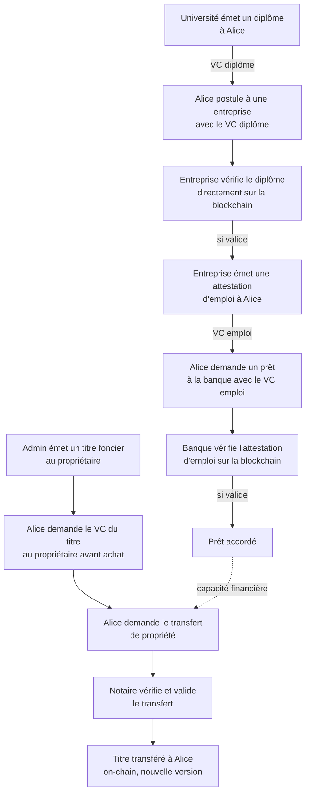
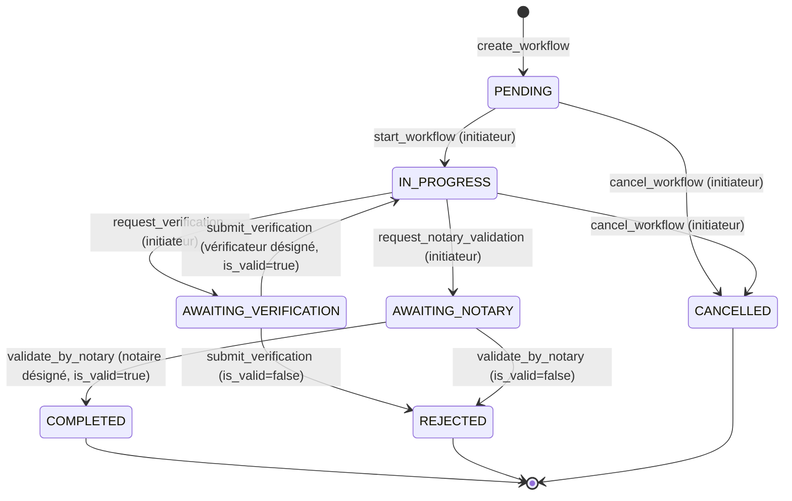
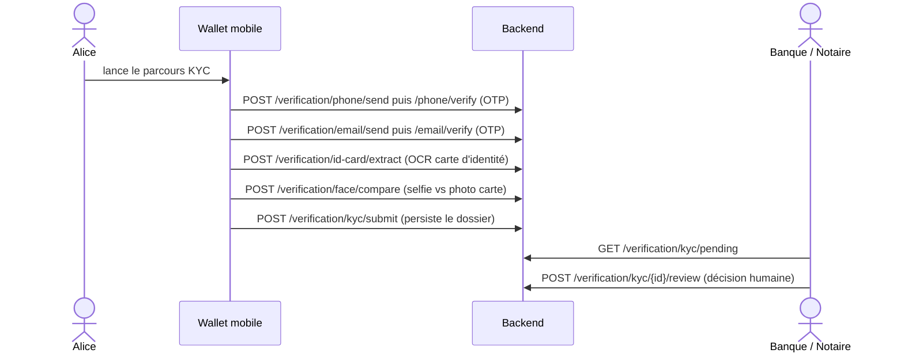

# TrustWedge — Workflow métier (cycle de confiance)

> Document 3/6 de la documentation projet. Voir [docs/README.md](README.md) pour l'index complet.
> Guide pas-à-pas écran par écran de ce même parcours : [ParcoursAlice.html](ParcoursAlice.html).

## 1. Le cycle de confiance, de bout en bout

TrustWedge modélise un parcours citoyen complet où chaque étape s'appuie sur la vérification blockchain de l'étape précédente, sans qu'aucun acteur n'ait à faire confiance a priori aux autres :

Chaque flèche correspond à une vérification on-chain réelle (`GET /documents/verify/{token_id}` ou équivalent), pas à une simple présentation de document.

## 2. Acteurs du parcours de référence

| Acteur | Rôle (`UserRole`) | Compte de test | Tableau de bord |
|---|---|---|---|
| Alice | `USER` | `alice@trustwedge.com` | `/alice` |
| Université | `ISSUER` | `university@trustwedge.com` | `/university` |
| Entreprise | `VERIFIER` | `company@trustwedge.com` | `/company` |
| Banque | `BANK` | `bank@trustwedge.com` | `/bank` |
| Notaire | `NOTARY` | `notary@trustwedge.com` | `/state` |
| Admin | `ADMIN` | — | gestion des titres, création d'acteurs |

Mot de passe identique pour tous en démo : `test1234` (non vérifié par le MVP — voir [01-SPECIFICATIONS.md](01-SPECIFICATIONS.md) §7).

## 3. Machine à états générique des workflows

Tous les types de workflow (`WorkflowType`) partagent la même machine à états (`services/backend/app/workflow_engine.py`) :

Règles d'autorisation appliquées par le moteur (`WorkflowEngine`) :
- Seul l'**initiateur** peut démarrer, demander une vérification, demander une validation notariale, ou annuler.
- Seul le **vérificateur désigné** (`target_user_id`) peut soumettre une vérification.
- Seul le **notaire désigné** (`notary_id`) peut valider.
- Un workflow déjà `COMPLETED` ou `REJECTED` ne peut plus être annulé.

## 4. Les 5 types de workflow

### 4.1 `DIPLOMA_VERIFICATION`

Vérification d'un diplôme par un tiers (typiquement une entreprise) auprès de l'université émettrice ou directement sur la blockchain.

### 4.2 `EMPLOYMENT_VERIFICATION`

Émission et/ou vérification d'une attestation d'emploi, préalable à une demande de prêt.

### 4.3 `LOAN_APPLICATION`

1. Alice initie la demande auprès de la banque (`create_workflow`, `target_user_id = banque`).
2. La banque vérifie l'attestation d'emploi (`request_verification` → `submit_verification`).
3. Si valide, le workflow repasse `IN_PROGRESS` puis peut être marqué `COMPLETED` (octroi du prêt).

### 4.4 `LAND_TRANSFER`

> Depuis l'introduction du mécanisme dédié (`transfers.py`), les transferts de titre foncier **n'utilisent plus** `validate_by_notary` du moteur générique — ils passent par le flux à triple signature décrit en [02-ARCHITECTURE.md](02-ARCHITECTURE.md) §10.3 (`initiate` → `accept` → `notary-finalize`), plus fort cryptographiquement (signatures ECDSA vérifiées on-chain plutôt qu'un simple changement de statut applicatif).

Séquence fonctionnelle complète :

1. Admin émet le titre foncier au propriétaire initial (`POST /documents/issue`, `doc_type=LAND_TITLE`).
2. Alice demande au propriétaire un VC du titre pour vérification avant achat (`GET /documents/verify/{token_id}` ou lien de partage `POST /shares`).
3. Alice et le vendeur initient le transfert (`POST /workflows/transfer/initiate`, signature vendeur).
4. Alice (acheteuse) accepte (`POST /workflows/transfer/accept`, signature acheteur).
5. Le notaire valide et finalise (`POST /workflows/transfer/notary-finalize`, signature notaire) → le NFT change de propriétaire on-chain, nouvelle version du document.

### 4.5 `ID_CARD_ISSUANCE`

Émission d'une pièce d'identité numérique, généralement en préalable au KYC citoyen (voir §5).

## 5. Parcours KYC (citoyen, wallet mobile)

Étape transverse, indépendante des 5 workflows ci-dessus mais souvent préalable à une demande de prêt ou de transfert foncier :

Les étapes techniques (OTP, OCR, face match) sont volontairement **sans état** — c'est le dossier `KycVerification` soumis à la fin qui persiste le résultat pour permettre une vraie revue humaine côté banque/notaire (files "Demandes KYC" des tableaux de bord).

## 6. Correspondance avec les endpoints API

| Étape du parcours | Endpoint(s) |
|---|---|
| Création d'un compte | `POST /auth/register`, `POST /admin/actors/create` |
| Émission d'un document | `POST /documents/issue` |
| Vérification publique | `GET /documents/verify/{token_id}` |
| Partage sélectif avant vérification | `POST /shares`, `GET /shares/{token}` |
| Cycle de workflow générique | `POST /workflows/create` → `/start` → `/request-verification` → `/submit-verification` → `/request-notary` → `/validate-by-notary` |
| Transfert de titre (triple signature) | `POST /workflows/transfer/initiate` → `/accept` → `/notary-finalize` |
| Parcours KYC | `POST /verification/phone/*`, `/email/*`, `/id-card/extract`, `/face/compare`, `/kyc/submit`, `/kyc/{id}/review` |
| Suivi des notifications | WebSocket `/ws/{user_id}`, `GET /notifications` |

## 7. Test de bout en bout

Le [README](../README.md) (§ "Tester l'application") fournit les commandes `curl` pour rejouer ce parcours complet via l'API, compte par compte. Le guide visuel pas-à-pas est disponible dans [ParcoursAlice.html](ParcoursAlice.html).
