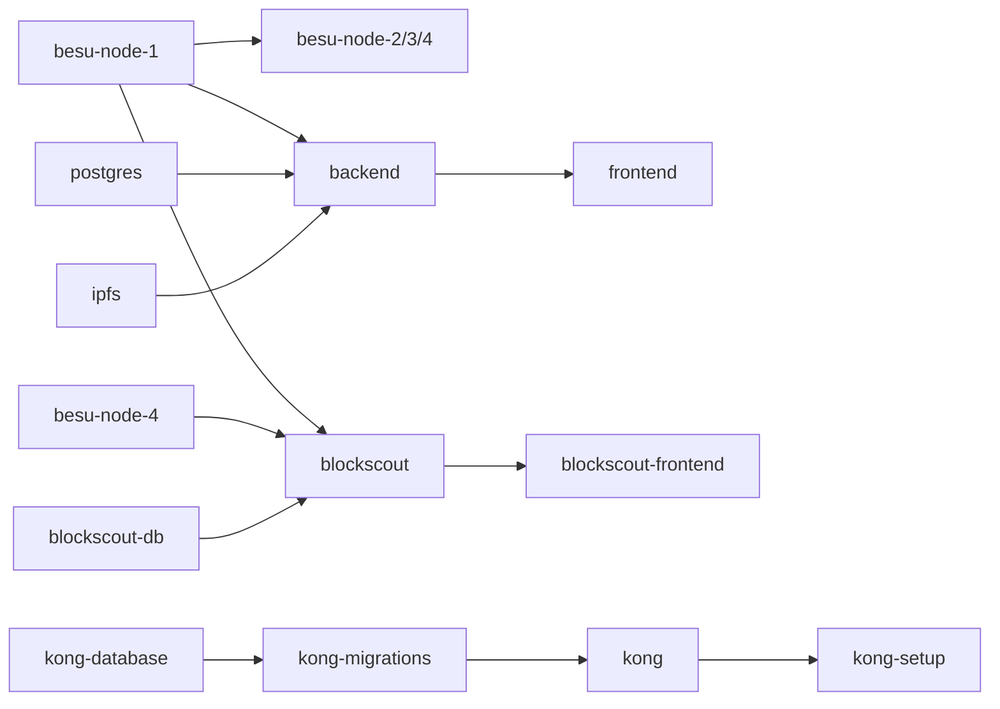

# TrustWedge — Description détaillée des services

> Document 7/8 de la documentation projet. Voir [docs/README.md](README.md) pour l'index complet.
> Complète [02-ARCHITECTURE.md](02-ARCHITECTURE.md) (vue d'ensemble) avec le détail technique de **chaque conteneur** défini dans `docker-compose.yml`, plus les modules internes du backend et les applications clientes.

## 1. Tableau de synthèse

| Service (docker-compose) | Image / build | Rôle | Port(s) hôte | Exposé publiquement |
|---|---|---|---|---|
| `besu-node-1` | `hyperledger/besu:latest` | Validateur QBFT n°1, RPC de déploiement | 30403 (P2P), 127.0.0.1:8645 (RPC, loopback) | P2P oui, RPC non (loopback) |
| `besu-node-2/3/4` | `hyperledger/besu:latest` | Validateurs QBFT n°2-4 | 30404-30406 (P2P) | P2P oui |
| `postgres` | `postgres:15-alpine` | Base applicative TrustWedge | 5442→5432 | Oui (à restreindre en prod) |
| `ipfs` | `ipfs/kubo:latest` | Nœud IPFS (stockage fichiers) | 4001 (swarm) | Swarm oui, API/gateway via Kong seulement |
| `backend` | build `services/backend` | API FastAPI | — (`expose: 8000`) | Non, via Kong `/api/*` |
| `frontend` | build `services/frontend` | SPA React (servie par un serveur statique) | — (`expose: 80`) | Non, via Kong `/` |
| `blockscout-db` | `postgres:15-alpine` | Base dédiée à l'explorateur | — | Non |
| `blockscout` | `blockscout/blockscout:latest` | Backend indexeur de blocs | — | Non, via Kong (`explorer-api.localhost`) |
| `blockscout-frontend` | `ghcr.io/blockscout/frontend:latest` | UI de l'explorateur | — | Non, via Kong (`explorer.localhost`) |
| `kong-database` | `postgres:13-alpine` | Base de configuration Kong | — | Non |
| `kong-migrations` | `kong:3.6` | Job one-shot : initialise le schéma Kong | — | — (tâche, pas un service persistant) |
| `kong` | `kong:3.6` | Passerelle API — **seul point d'entrée public** | **8000 (HTTP), 8443 (HTTPS)** | Oui, volontairement |
| `kong-setup` | `curlimages/curl:8.10.1` | Déclare services/routes/plugins Kong au démarrage | — | — (tâche, idempotente) |

Réseau Docker unique `trustwedge-network` (bridge, sous-réseau `172.26.0.0/16`), tous les services s'y résolvent par leur nom de conteneur (ex. `http://backend:8000`, `http://besu-node-1:8545`).

## 2. Réseau blockchain — `besu-node-1..4`

- **Rôle** : réseau privé à 4 validateurs, consensus **QBFT** (Byzantine Fault Tolerant) — tolère la défaillance d'1 nœud sur 4 sans interrompre la production de blocs.
- **Paramètres consensus** (`config/qbftConfigFile.json`) : `chainId=1337` (dev), période de bloc **2 secondes**, timeout de requête **4 secondes**, longueur d'époque **30000 blocs**.
- **Stockage** : format `BONSAI` (format d'état optimisé de Besu).
- **node-1** est le nœud "bootnode" : les 3 autres pointent vers lui (`--bootnodes=enode://...@172.26.0.10:30303`) pour découvrir le réseau P2P, et montent son dossier de données en lecture seule pour lire sa clé publique.
- **API RPC exposées par nœud** : node-1 expose `ETH,NET,QBFT,WEB3,ADMIN,DEBUG,TXPOOL` (le plus complet, utilisé pour le déploiement Hardhat) ; node-2/3 exposent un sous-ensemble proche ; node-4 (utilisé par Blockscout pour le mode "trace") expose `ETH,NET,WEB3,DEBUG,TRACE,TXPOOL`.
- **`--rpc-http-cors-origins=*` et `--host-allowlist=*`** au niveau Besu lui-même : sans conséquence en l'état car seul node-1 est exposé, et uniquement en loopback (127.0.0.1) — à ne jamais élargir sans réévaluer l'exposition.
- **Génération** : `scripts/generate-network.bat` — génère les clés (privée/publique) de chaque nœud et le `genesis.json` de démarrage. Doit être **rejouée avec des clés neuves** pour tout réseau de production (ne jamais réutiliser les clés de développement).

## 3. Contrats — mécanisme de déploiement (`services/nodes`)

- **Outil** : Hardhat (`hardhat.config.js`, réseau `besu` pointant sur `127.0.0.1:8645`).
- **Compilateur** : Solidity `^0.8.28`.
- **Dépendances** : OpenZeppelin Contracts (`ERC721URIStorage`, `AccessControl`, `Counters`, `Strings`).
- **Déploiement** : `npx hardhat run scripts/deploy.js --network besu` → écrit l'adresse déployée, à reporter manuellement dans `CONTRACT_ADDRESS` (`.env`) puis à faire prendre en compte par le backend (redémarrage).
- Détail des deux contrats (`DocumentRegistry.sol`, `EthereumDIDRegistry.sol`) : [02-ARCHITECTURE.md](02-ARCHITECTURE.md) §3.

## 4. `postgres` — base applicative

- **Image** : `postgres:15-alpine`.
- **Rôle** : persiste l'état applicatif miroir de la blockchain (`Document`), plus tout ce qui n'a pas vocation à être on-chain (`User`, `Workflow`, `Notification`, `KycVerification`, `DocumentShare`...). Schéma complet : [09-SPECIFICATION-TECHNIQUE-DONNEES.md](09-SPECIFICATION-TECHNIQUE-DONNEES.md).
- **Création du schéma** : `Base.metadata.create_all(bind=engine)` au démarrage du backend (SQLAlchemy) — pas de système de migration (Alembic) à ce stade, donc pas d'historique de migration versionné.
- **Port hôte 5442** (au lieu de 5432 par défaut) pour éviter un conflit avec d'autres projets locaux.

## 5. `ipfs` — stockage de fichiers

- **Image** : `ipfs/kubo:latest`, profil `server`.
- **Rôle** : stocke les fichiers (PDF générés) référencés par leur CID dans les documents on-chain.
- **Accès** : API et gateway HTTP **non exposées directement** à l'hôte — uniquement via `IPFSClient` (backend, réseau interne) et via Kong (`/ipfs/*`, lecture seule, gateway).
- **Port hôte 4001** : swarm P2P IPFS (nécessaire pour le fonctionnement du réseau IPFS lui-même, indépendant de l'usage applicatif).
- **Client** (`services/backend/app/ipfs_utils.py`) : appels HTTP directs à l'API Kubo via `requests` (la librairie `ipfshttpclient`, abandonnée depuis 2020, est incompatible avec les versions récentes de Kubo).

## 6. `backend` — API FastAPI

Voir détail des modules et des routes dans [02-ARCHITECTURE.md](02-ARCHITECTURE.md) §4. Éléments d'exécution :

- **Build** : image dédiée (`services/backend/Dockerfile`), dépendances Python figées dans `requirements.txt`.
- **Montage en développement** : `./services/backend/app:/app/app` — le code est monté en volume, pas seulement copié à la construction de l'image (rechargement à chaud désactivé — voir §8).
- **Dépendances runtime** : attend `postgres`, `ipfs`, `besu-node-1`.
- **Non exposé à l'hôte** : `expose: 8000` seulement (visible sur le réseau Docker interne), accessible depuis l'extérieur uniquement via Kong.
- **Bibliothèques clés** : `fastapi`, `web3==6.11.1`, `sqlalchemy`, `python-jose[cryptography]` (JWT), `passlib[bcrypt]` (hash de mot de passe — présent mais non branché, voir [08-SECURITE.md](08-SECURITE.md)), `reportlab` (génération de PDF), `pytesseract`/`pdf2image`/`Pillow` (OCR).

## 7. `frontend` — application web React

- **Build** : `services/frontend`, arguments de build `REACT_APP_API_URL`/`REACT_APP_WS_URL` injectés à la compilation (donc figés dans le bundle statique généré — un changement de ces valeurs nécessite un rebuild, pas seulement un redémarrage).
- **Service** : build statique servi sur le port interne 80, exposé uniquement via Kong (`/`).
- **Contenu** : 5 tableaux de bord par rôle (voir [06-GUIDE-UTILISATION.md](06-GUIDE-UTILISATION.md)).

## 8. `blockscout` + `blockscout-db` + `blockscout-frontend` — explorateur de blocs

- **`blockscout-db`** : PostgreSQL dédiée (isolée de la base applicative TrustWedge), identifiants fixes `blockscout/blockscout` en local — **à changer en production** (actuellement en clair dans `docker-compose.yml`, contrairement aux autres bases qui utilisent des variables `.env`).
- **`blockscout`** : indexeur qui lit en continu les blocs depuis `besu-node-1` (HTTP JSON-RPC) et `besu-node-4` (endpoint "trace"), stocke l'historique indexé côté `blockscout-db`. Démarre par une migration (`bin/blockscout eval "Elixir.Explorer.ReleaseTasks.create_and_migrate()"`) avant de lancer le serveur.
- **`blockscout-frontend`** : UI Next.js, image publiée sur GitHub Container Registry (pas Docker Hub). Configurée pour interroger l'API via Kong avec des noms d'hôte dédiés (`explorer.localhost` / `explorer-api.localhost`) plutôt qu'un préfixe de chemin, car l'app référence ses assets en chemin absolu depuis la racine.
- **Rôle sécurité** : permet un **audit indépendant** de la chaîne, sans dépendre de l'API TrustWedge — un tiers peut vérifier lui-même qu'aucune transaction n'a été dissimulée ou modifiée après coup.

## 9. `kong` + `kong-database` + `kong-migrations` + `kong-setup` — passerelle API

- **`kong-database`** : PostgreSQL dédiée à la configuration de Kong (services, routes, plugins) — isolée des autres bases.
- **`kong-migrations`** : job one-shot (`kong migrations bootstrap`), s'exécute une fois puis s'arrête (`restart: "no"`), condition de démarrage pour `kong`.
- **`kong`** : seul service exposé publiquement (`8000` HTTP, `8443` HTTPS). `KONG_ADMIN_LISTEN=0.0.0.0:8001` **sans publication du port** vers l'hôte — l'Admin API (sans authentification native en édition Community) reste donc cantonnée au réseau Docker interne.
- **`kong-setup`** : conteneur utilitaire (`curlimages/curl`), exécute `scripts/kong-setup.sh` une seule fois au démarrage pour déclarer services/routes/plugins via l'Admin API. Script idempotent (`PUT`, rejouable sans effet de bord).
- Détail du routage, CORS et rate limiting : [02-ARCHITECTURE.md](02-ARCHITECTURE.md) §7 et [08-SECURITE.md](08-SECURITE.md) §4.

## 10. Modules internes du backend (hors routes HTTP)

| Module | Rôle |
|---|---|
| `blockchain.py` (`BlockchainClient`) | Encapsule `web3.py` : construction, signature et envoi des transactions vers `DocumentRegistry`, lecture de l'ABI, décodage des erreurs de `revert` |
| `ipfs_utils.py` (`IPFSClient`) | Upload/téléchargement de fichiers vers/depuis IPFS via l'API HTTP Kubo |
| `workflow_engine.py` (`WorkflowEngine`) | Machine à états des 5 types de workflow métier (voir [03-WORKFLOW.md](03-WORKFLOW.md)) |
| `event_bus.py` | Bus d'événements WebSocket (notifications temps réel par utilisateur) |
| `auth.py` | Hash/vérification de mot de passe (bcrypt), émission/vérification de JWT, dépendances FastAPI d'authentification |
| `services/did_service.py` (`DIDService`) | Génération de paire de clés Ethereum par utilisateur, chiffrement/déchiffrement de la clé privée (Fernet) |
| `services/signature_service.py` | Signature/vérification de hash en ECDSA (EIP-191 et brut) — utilisé pour le transfert à triple signature |
| `services/pdf_generator.py` | Génération des PDF représentatifs des documents/titres (ReportLab) |
| `services/ocr_service.py`, `services/id_card_ocr_service.py` | OCR (Tesseract) — réel, utilisé pour les titres fonciers et les cartes d'identité |
| `services/face_match_service.py` | Correspondance faciale — **mockée** (voir [08-SECURITE.md](08-SECURITE.md) §6) |
| `services/verification_service.py` | OTP téléphone/email — logique de vérification réelle (JWT à expiration), envoi SMS/email **mocké** (loggé en console) |
| `services/notification_service.py` | Construction des notifications applicatives persistées |

## 11. Applications clientes

### 11.1 Frontend web (React)

Voir [02-ARCHITECTURE.md](02-ARCHITECTURE.md) §8 et [06-GUIDE-UTILISATION.md](06-GUIDE-UTILISATION.md) pour le détail par tableau de bord.

### 11.2 Wallet mobile (`apps/wallet`)

- **Stack** : React Native / Expo (TypeScript).
- **Rôle** : application citoyenne — gestion des documents détenus, partage sélectif, parcours KYC. Détail : [WALLET.md](WALLET.md) et [06-GUIDE-UTILISATION.md](06-GUIDE-UTILISATION.md) §3.
- **Dépendance** : `packages/sdk` (client API/blockchain partagé) et `packages/shared` (types partagés).

### 11.3 `packages/sdk` et `packages/shared`

Espaces de travail npm (`workspaces` du `package.json` racine) : code partagé entre le wallet mobile et, potentiellement à terme, le frontend web — évite la duplication des types et du client API entre les deux applications clientes. Buildés indépendamment (`npm run build:sdk`, `npm run build:shared`), hors du pipeline Docker (`services/frontend` et `services/backend` restent buildés indépendamment par Docker, comme précisé dans le `package.json` racine).

## 12. Dépendances de démarrage (ordre logique)

`docker compose up -d` respecte cet ordre via les `depends_on` déclarés ; le déploiement du contrat (Hardhat, hors Compose) doit intervenir **après** que `besu-node-1` soit sain, et le redémarrage du `backend` **après** la mise à jour de `CONTRACT_ADDRESS`.
