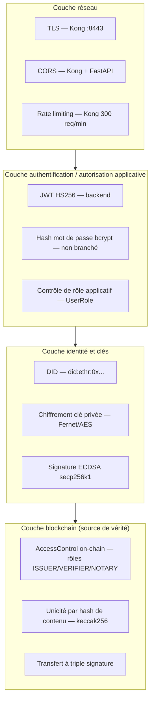

# TrustWedge — Sécurité : outils et techniques cryptographiques

> Document 8/8 de la documentation projet. Voir [docs/README.md](README.md) pour l'index complet.
> Ce document détaille **ce qui est réellement implémenté** (outil par outil, technique par technique) ainsi que **ce qui est mocké ou volontairement absent** dans le MVP — à ne pas confondre. Le plan de correction avant mise en production est en [04-DEPLOIEMENT-PRODUCTION.md](04-DEPLOIEMENT-PRODUCTION.md) §1.

## 1. Vue d'ensemble des couches de sécurité

La blockchain (couche 4) est conçue pour rester la **source de vérité ultime** : même si les couches 1-3 étaient contournées, un appel direct au contrat resterait bloqué par `AccessControl` (rôle on-chain) et par les vérifications de signature/unicité du contrat lui-même.

## 2. Authentification

| Élément | Implémentation | Statut |
|---|---|---|
| Émission de session | JWT, algorithme **HS256** (`python-jose[cryptography]`), secret `JWT_SECRET`, expiration configurable (`JWT_EXPIRATION`, en heures) | Actif |
| Contenu du token | `sub` (id utilisateur), `role`, `exp` | Actif |
| Vérification du token | `get_current_user` (`auth.py`) — décodage + recherche de l'utilisateur en base à chaque requête protégée | Actif |
| Hash de mot de passe | `passlib[bcrypt]` (`CryptContext(schemes=["bcrypt"])`), fonctions `get_password_hash`/`verify_password` **implémentées** | **Non appelées** — `register_user` ne hash et ne stocke aucun mot de passe, `login_user` retrouve l'utilisateur par email uniquement et émet un JWT valide quel que soit le mot de passe soumis |
| Verrouillage local (mobile) | Code PIN (`SetupPinScreen`/`LockScreen`, wallet) | Protège l'accès à l'app, indépendant du compte serveur |

**Conséquence pratique** : en l'état, connaître l'email d'un compte enregistré suffit à obtenir un JWT valide pour ce compte. C'est un choix assumé de démo (cf. README, § Sécurité) — la correction est un branchement de fonctions déjà écrites, pas un développement à faire de zéro.

## 3. Autorisation

Deux couches indépendantes, dont la seconde ne peut pas être contournée depuis l'API :

1. **Applicative** (Python) : chaque route vérifie `current_user["role"]` ou l'appartenance (`initiator_id`, `target_user_id`, `notary_id`) avant d'agir — ex. `issue_document_with_workflow` refuse tout rôle hors `ISSUER/VERIFIER/NOTARY/ADMIN` (`workflow_engine.py`).
2. **On-chain** (Solidity `AccessControl`, OpenZeppelin) : le contrat `DocumentRegistry` impose ses propres modificateurs (`onlyIssuer`, `onlyNotary`) indépendamment de ce que l'API a déjà vérifié — une transaction signée par une clé sans le rôle on-chain requis est rejetée par le contrat lui-même, même si elle contournait l'API.

Table de correspondance rôle applicatif → rôle on-chain : voir [01-SPECIFICATIONS.md](01-SPECIFICATIONS.md) §3 et `ROLE_TO_CONTRACT_ROLE` (`models.py`).

**Restriction "mes propres comptes"** : `GET /users?mine=true` limite un émetteur à la liste des comptes qu'il a lui-même créés (`created_by`) — empêche qu'une entreprise émette une attestation à n'importe quel utilisateur de la plateforme plutôt qu'à ses propres employés.

## 4. Sécurité réseau et transport

| Élément | Détail |
|---|---|
| Point d'entrée unique | Kong (`:8000` HTTP, `:8443` HTTPS) — tous les autres services (backend, frontend, IPFS, RPC Besu) sont non exposés à l'hôte, sauf le RPC de node-1 en loopback |
| TLS | Certificat **auto-signé** ("snake oil") par défaut sur `:8443` — à remplacer par un certificat valide avant toute exposition publique réelle (voir [04-DEPLOIEMENT-PRODUCTION.md](04-DEPLOIEMENT-PRODUCTION.md) §2) |
| CORS — niveau Kong | Plugin `cors` global, origines explicitement listées (`http://localhost:8000`, `http://explorer.localhost:8000`), méthodes/headers restreints, `credentials:true` (`scripts/kong-setup.sh`) |
| CORS — niveau FastAPI | `allow_origins=["*"]` dans `main.py` — **plus permissif que la configuration Kong**. Sans conséquence tant que le backend n'est joignable qu'à travers Kong (seul point d'entrée), mais **incohérence à corriger** avant tout scénario où le backend serait un jour accessible autrement (ex. appel direct entre conteneurs d'un futur service tiers) |
| Rate limiting | Plugin `rate-limiting` Kong, 300 requêtes/minute, politique `local` (par nœud Kong — pas de compteur partagé, donc pas adapté tel quel à un Kong multi-instance) |
| Admin API Kong | `:8001` **non publié** vers l'hôte (pas d'authentification native en édition Community) — accès restreint au réseau Docker interne uniquement |
| RPC Besu | Seul node-1 expose son RPC à l'hôte, et uniquement en **loopback** (`127.0.0.1:8645`) — jamais en `0.0.0.0` |

## 5. Identité et cryptographie des clés

### 5.1 DID (Decentralized Identifiers)

- Format `did:ethr:0x<adresse Ethereum>` — chaque utilisateur possède une paire de clés ECDSA secp256k1 (la même courbe qu'Ethereum/Bitcoin), générée côté serveur à la création du compte (`did_service.generate_did_for_actor`).
- Génération de clé : `secrets.token_hex(32)` (aléatoire cryptographiquement sûr, module standard Python `secrets`) → dérivation de l'adresse via `eth_account.Account.from_key`.

### 5.2 Chiffrement de la clé privée au repos

- **Algorithme** : Fernet (`cryptography.fernet`) — AES-128 en mode CBC avec authentification HMAC-SHA256 intégrée (chiffrement symétrique authentifié).
- **Clé de chiffrement** : `ENCRYPTION_KEY` (variable d'environnement), unique pour toute l'instance — toutes les clés privées utilisateurs stockées en base (`User.private_key_encrypted`) sont chiffrées avec cette même clé.
- **Déchiffrement** : uniquement à la volée, au moment de signer une transaction pour le compte d'un `ISSUER` (`did_service.get_private_key`) — jamais persisté en clair.
- **Point d'attention** : la clé privée est retournée **en clair** dans la réponse HTTP au moment de la création d'un acteur (`ActorCreateResponse.private_key`, `POST /admin/actors/create`) et de la régénération de clé (`POST /did/regenerate`) — c'est le canal de transmission voulu (l'acteur doit récupérer sa clé une fois), mais cela signifie que cette réponse ne doit jamais transiter ou être journalisée en clair au-delà de ce point (HTTPS obligatoire en production, pas de logging du corps de réponse).

### 5.3 Signature de transaction blockchain

- **Algorithme** : ECDSA sur courbe secp256k1 (standard Ethereum), via `web3.py` (`eth_account.Account.sign_transaction`).
- **Qui signe quoi** :
  - `ISSUER` avec clé propre déchiffrée : émission de documents en son nom.
  - `VERIFIER`/`NOTARY`/`ADMIN` sans clé propre exploitée pour l'émission : retombent sur la **clé de plateforme unique** (`PRIVATE_KEY`, `.env`), qui détient `ISSUER_ROLE` depuis le déploiement — voir limitation documentée en [01-SPECIFICATIONS.md](01-SPECIFICATIONS.md) §7.
  - Vendeur/acheteur/notaire (transfert à triple signature) : chacun signe avec sa propre clé.

### 5.4 Signature hors-chaîne (`services/signature_service.py`)

Deux variantes utilisées selon le besoin, à ne pas confondre :

- **EIP-191 (`personal_sign`)** : `sign_hash`/`verify_hash_signature` — préfixe le message avant signature (protection contre la réutilisation d'une signature comme transaction brute).
- **ECDSA brut (sans préfixe)** : `sign_raw_hash`/`verify_raw_hash_signature` — utilisé spécifiquement pour le transfert à triple signature, car c'est ce que le contrat `DocumentRegistry` vérifie via `ecrecover()` côté Solidity (`_recoverSigner`). Le message signé est `keccak256(tokenId, buyerAddress, chainId)` — l'inclusion du `chainId` empêche qu'une signature produite sur un réseau (ex. test) soit rejouée sur un autre.

### 5.5 Intégrité et unicité des documents

- **Hash de contenu** : chaque fichier uploadé sur IPFS produit un **CID**, empreinte cryptographique de son contenu (fonction de hachage IPFS, multihash — par défaut SHA-256 sous Kubo). Toute modification, même minime, change le CID.
- **Unicité on-chain à deux niveaux** (`DocumentRegistry.sol`) : par couple (`docType`, `docKey`) **et** par CID (`hashToTokenId`) — empêche la double émission d'un même contenu et la réémission d'une même référence avec un contenu différent par le canal normal d'émission.
- **Vérification DID ↔ signataire** : le contrat recalcule l'adresse encodée dans le DID fourni (`_resolveDidToAddress`) et exige qu'elle corresponde à l'adresse ayant signé la transaction (`msg.sender`) — empêche qu'un émetteur signe un document au nom du DID d'un autre émetteur.

## 6. KYC — ce qui est réel vs. mocké

Point important pour toute présentation externe : **ne pas présenter les briques mockées comme opérationnelles**.

| Étape | Statut | Détail |
|---|---|---|
| OTP téléphone/email | **Logique réelle**, transport mocké | Code à 6 chiffres, seul son **hash SHA-256** est transporté dans un JWT à expiration (5 min téléphone / 24h email) — le code en clair n'est jamais stocké ; en revanche l'envoi SMS/email lui-même n'est pas branché (pas de Twilio/SMTP) : le code est simplement **loggé côté serveur** (`docker compose logs backend`). `PhoneSendResponse.dev_code` expose même le code dans la réponse HTTP — commentaire explicite dans le code : *"en conditions réelles, le code ne doit JAMAIS transiter par cette réponse HTTP, seul le SMS le porte"* |
| OCR carte d'identité | **Réel** | Tesseract (`pytesseract`/`pdf2image`), même moteur que celui déjà utilisé pour l'import de titres fonciers |
| Correspondance faciale | **Entièrement mockée** | `face_match_service.compare_faces_mock` ne compare **rien** — renvoie un score simulé mais déterministe (dérivé d'un hash SHA-256 des deux images, pas aléatoire à chaque appel) pour un comportement stable en démo. Le champ `mocked: true` est renvoyé explicitement par l'API (`FaceCompareResponse.mocked`) pour que l'appelant sache que le résultat n'est pas probant |
| Revue humaine finale | **Réelle** | Le dossier KYC est persisté (`KycVerification`) pour permettre une décision humaine (banque/notaire) via `POST /verification/kyc/{id}/review`, indépendamment de la fiabilité des étapes automatisées ci-dessus |

## 7. Traçabilité et non-répudiation

- **Historique immuable** : chaque émission, transfert, révocation ou changement de version est un événement on-chain (`DocumentIssued`, `DocumentTransferred`, `DocumentRevoked`, `DocumentVersionAdded`, `TransferRequested/Accepted/Completed`) — consultable indéfiniment, y compris indépendamment de TrustWedge via Blockscout.
- **Audit indépendant** : Blockscout permet à un tiers de vérifier une transaction sans faire confiance à l'opérateur de la plateforme (voir [07-SERVICES.md](07-SERVICES.md) §8).
- **Non-répudiation des signatures** : toute signature ECDSA est mathématiquement liée à l'adresse du signataire (`ecrecover`) — un signataire ne peut pas nier avoir signé une transaction valide portant son adresse.

## 8. Secrets — inventaire et gestion actuelle

Voir l'inventaire complet des variables et leur recommandation de production dans [04-DEPLOIEMENT-PRODUCTION.md](04-DEPLOIEMENT-PRODUCTION.md) §4. Résumé de l'état actuel :

- Tous les secrets applicatifs (`JWT_SECRET`, `PRIVATE_KEY`, `ENCRYPTION_KEY`, mots de passe Postgres/Kong...) sont des **variables d'environnement en clair** (`.env`), sans coffre-fort dédié. Génération initiale automatisée par `scripts/init-environment.js` (valeurs aléatoires cryptographiquement sûres — voir [10-INITIALISATION-ENVIRONNEMENT.md](10-INITIALISATION-ENVIRONNEMENT.md)), mais gestion (rotation, coffre-fort) toujours manuelle au-delà de ce premier provisionnement.
- Exception notable : `blockscout-db` utilise des identifiants **fixes et codés en dur** dans `docker-compose.yml` (`blockscout`/`blockscout`), pas de variable `.env` — à corriger en priorité si Blockscout venait à être exposé plus largement, même s'il ne stocke aujourd'hui que des données déjà publiques on-chain.

## 9. Synthèse des correctifs de sécurité avant production

Reprise consolidée (détails et procédure : [04-DEPLOIEMENT-PRODUCTION.md](04-DEPLOIEMENT-PRODUCTION.md) §1) :

1. Brancher `verify_password`/`get_password_hash` dans `login_user`/`register_user`.
2. Statuer sur la clé de signature mutualisée (`PRIVATE_KEY`) pour les rôles sans clé propre.
3. Régénérer tous les secrets, y compris les identifiants `blockscout-db` actuellement en dur.
4. Aligner le CORS FastAPI (`main.py`) sur la politique déjà appliquée par Kong plutôt que `allow_origins=["*"]`.
5. Remplacer le certificat TLS auto-signé de Kong.
6. Avant toute utilisation réelle du KYC pour une décision engageante (prêt, transfert de propriété) : remplacer la correspondance faciale mockée par un service réel, et brancher un vrai canal d'envoi SMS/email (supprimer `dev_code` de la réponse HTTP).
