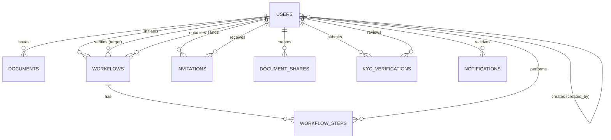

# TrustWedge — Spécification technique des données

> Document 9/9 de la documentation projet. Voir [docs/README.md](README.md) pour l'index complet.
> Complète [01-SPECIFICATIONS.md](01-SPECIFICATIONS.md) (spécifications fonctionnelles, résumé du modèle de données) avec le détail **colonne par colonne** du schéma PostgreSQL, la structure on-chain du contrat, et les schémas de requête/réponse de l'API. Source : `services/backend/app/models.py`, `schemas.py`, `services/nodes/contrat/DocumentRegistry.sol`.

## 1. Schéma de base de données (PostgreSQL, via SQLAlchemy)

Créé automatiquement au démarrage du backend (`Base.metadata.create_all`) — **pas de migrations Alembic** à ce stade : toute évolution de schéma en production nécessite une procédure manuelle (voir [04-DEPLOIEMENT-PRODUCTION.md](04-DEPLOIEMENT-PRODUCTION.md)).

### 1.1 `users`

| Colonne | Type | Contraintes | Description |
|---|---|---|---|
| `id` | Integer | PK, index | Identifiant interne |
| `did` | String | unique, index | `did:ethr:0x...` |
| `address` | String | unique, index | Adresse Ethereum (dérivée de la clé publique) |
| `email` | String | unique, index | Identifiant de connexion |
| `full_name` | String | | Nom affiché |
| `role` | String | | Valeur de `UserRole` : `ADMIN`, `ISSUER`, `VERIFIER`, `BANK`, `NOTARY`, `USER` |
| `private_key_encrypted` | String | nullable | Clé privée chiffrée (Fernet) — voir [08-SECURITE.md](08-SECURITE.md) §5.2 |
| `public_key` | String | nullable | Clé publique en hexadécimal |
| `created_by` | Integer | FK → `users.id`, nullable | Compte ayant créé cet utilisateur (restriction "mes comptes") |
| `is_active` | Boolean | default `true` | Désactivation logique |
| `created_at` | DateTime (tz) | default `now()` | |

### 1.2 `documents`

| Colonne | Type | Contraintes | Description |
|---|---|---|---|
| `id` | Integer | PK, index | |
| `token_id` | Integer | unique, index | ID du NFT on-chain correspondant |
| `issuer` | String | FK → `users.address` | Adresse de l'émetteur |
| `owner` | String | | Adresse du titulaire actuel |
| `doc_type` | String | | Ex. `DIPLOMA`, `LAND_TITLE` |
| `doc_key` | String | | Référence métier unique au sein du `doc_type` (ex. n° de titre foncier) |
| `ipfs_cid` | String | | CID du fichier courant |
| `is_active` | Boolean | default `true` | `false` si révoqué |
| `is_transferable` | Boolean | default `false` | Autorise le mécanisme de transfert à triple signature |
| `attributes` | JSON | default `[]` | Liste d'objets `{key, value, valueType}` |
| `created_at` | DateTime (tz) | default `now()` | |

Contrainte : `UNIQUE(doc_type, doc_key)` (`uq_documents_doc_type_doc_key`) — miroir applicatif de l'unicité déjà imposée on-chain.

> Ce tableau est un **miroir** du NFT on-chain (source de vérité = la blockchain), maintenu pour la consultation rapide côté API sans requête RPC systématique.

### 1.3 `invitations`

| Colonne | Type | Contraintes | Description |
|---|---|---|---|
| `id` | Integer | PK, index | |
| `from_user_id` | Integer | FK → `users.id` | |
| `to_user_id` | Integer | FK → `users.id` | |
| `token_id` | Integer | | Document concerné, le cas échéant |
| `message` | String | | |
| `status` | String | default `"PENDING"` | |
| `created_at` | DateTime (tz) | default `now()` | |
| `responded_at` | DateTime (tz) | nullable | |

### 1.4 `workflows`

| Colonne | Type | Contraintes | Description |
|---|---|---|---|
| `id` | Integer | PK, index | |
| `workflow_type` | Enum(`WorkflowType`) | not null | `EMPLOYMENT_VERIFICATION`, `DIPLOMA_VERIFICATION`, `LAND_TRANSFER`, `LOAN_APPLICATION`, `ID_CARD_ISSUANCE` |
| `status` | Enum(`WorkflowStatus`) | default `PENDING` | `PENDING`, `IN_PROGRESS`, `AWAITING_VERIFICATION`, `AWAITING_NOTARY`, `COMPLETED`, `REJECTED`, `CANCELLED` |
| `initiator_id` | Integer | FK → `users.id` | |
| `target_user_id` | Integer | FK → `users.id`, nullable | Vérificateur désigné |
| `notary_id` | Integer | FK → `users.id`, nullable | Notaire désigné |
| `document_token_id` | Integer | nullable | |
| `document_cid` | String | nullable | |
| `workflow_data` | JSON | default `{}` | Données libres par étape (horodatages, motifs...) |
| `transaction_hash` | String | nullable | Hash de la transaction de finalisation |
| `seller_signature` | String | nullable | Vente entre particuliers (`LAND_TRANSFER`) |
| `buyer_signature` | String | nullable | |
| `notary_signature` | String | nullable | |
| `transfer_request_hash` | String | nullable | |
| `created_at` | DateTime (tz) | default `now()` | |
| `updated_at` | DateTime (tz) | onupdate `now()` | |
| `completed_at` | DateTime (tz) | nullable | |

Relation : `steps` (1-N vers `workflow_steps`, `cascade="all, delete-orphan"`, ordonnée par `created_at`).

### 1.5 `workflow_steps`

| Colonne | Type | Contraintes | Description |
|---|---|---|---|
| `id` | Integer | PK, index | |
| `workflow_id` | Integer | FK → `workflows.id` | |
| `step_name` | String | not null | |
| `actor_id` | Integer | FK → `users.id` | |
| `action` | String | | |
| `status` | String | default `"PENDING"` | |
| `step_data` | JSON | default `{}` | |
| `created_at` | DateTime (tz) | default `now()` | |

### 1.6 `document_shares`

| Colonne | Type | Contraintes | Description |
|---|---|---|---|
| `id` | Integer | PK, index | |
| `share_token` | String | unique, index | Jeton opaque intégré au lien de partage |
| `token_id` | Integer | index | Document partagé |
| `created_by` | Integer | FK → `users.id` | |
| `access_level` | String | default `"view"` | `view` (métadonnées/statut) ou `download` (autorise aussi le PDF) |
| `expires_at` | DateTime (tz) | nullable | `null` = pas d'expiration |
| `revoked` | Boolean | default `false` | |
| `created_at` | DateTime (tz) | default `now()` | |

> La résolution (`GET /shares/{share_token}`) relit toujours l'état réel du document on-chain avant de répondre — un lien ne fait foi de rien par lui-même (voir [01-SPECIFICATIONS.md](01-SPECIFICATIONS.md) §4.6).

### 1.7 `kyc_verifications`

| Colonne | Type | Contraintes | Description |
|---|---|---|---|
| `id` | Integer | PK, index | |
| `user_id` | Integer | FK → `users.id`, index | |
| `full_name` | String | | |
| `id_card_number` | String | nullable | |
| `id_card_data` | JSON | default `{}` | Sortie brute de l'OCR |
| `phone_verified` | Boolean | default `false` | |
| `email_verified` | Boolean | default `false` | |
| `face_match_passed` | Boolean | default `false` | Résultat du service **mocké** — voir [08-SECURITE.md](08-SECURITE.md) §6 |
| `status` | Enum(`KycStatus`) | default `PENDING` | `PENDING`, `APPROVED`, `REJECTED` |
| `reviewed_by` | Integer | FK → `users.id`, nullable | |
| `reviewer_notes` | String | nullable | |
| `created_at` | DateTime (tz) | default `now()` | |
| `reviewed_at` | DateTime (tz) | nullable | |

### 1.8 `notifications`

| Colonne | Type | Contraintes | Description |
|---|---|---|---|
| `id` | Integer | PK, index | |
| `user_id` | Integer | FK → `users.id`, index | |
| `type` | String | | |
| `message` | String | | |
| `workflow_id` | Integer | nullable | |
| `token_id` | Integer | nullable | |
| `read` | Boolean | default `false` | |
| `created_at` | DateTime (tz) | default `now()` | |
| `completed_at` | DateTime (tz) | nullable | |

### 1.9 Diagramme entité-relation

## 2. Structure de données on-chain (`DocumentRegistry.sol`)

### 2.1 `struct Document` (stockage principal, `mapping(uint256 => Document) _documents`)

| Champ | Type Solidity | Description |
|---|---|---|
| `docType` | `string` | Ex. `LAND_TITLE`, `DIPLOMA` |
| `docKey` | `string` | Référence métier (ex. `TF-2024-0001`) |
| `issuerDid` | `string` | `did:ethr:0x...` de l'émetteur |
| `issuerAddress` | `address` | Adresse ayant signé l'émission |
| `owner` | `address` | Titulaire actuel |
| `issuanceDate` | `uint256` | Timestamp bloc |
| `isActive` | `bool` | `false` si révoqué |
| `ipfsCid` | `string` | CID courant |
| `attributes` | `Attribute[]` | Voir ci-dessous |
| `isTransferable` | `bool` | |
| `versions` | `DocumentVersion[]` | Historique complet |
| `versionCount` | `uint256` | |

### 2.2 `struct Attribute`

| Champ | Type | Valeurs possibles (`valueType`) |
|---|---|---|
| `key` | `string` | |
| `value` | `string` | |
| `valueType` | `string` | `"string"`, `"uint256"`, `"address"`, `"date"`, `"boolean"` |

### 2.3 `struct DocumentVersion`

| Champ | Type |
|---|---|
| `ipfsCid` | `string` |
| `owner` | `address` |
| `timestamp` | `uint256` |

### 2.4 `struct TransferRequest` (`mapping(uint256 => TransferRequest) transferRequests`)

| Champ | Type | Description |
|---|---|---|
| `seller` | `address` | |
| `buyer` | `address` | |
| `tokenId` | `uint256` | |
| `sellerSignature` | `bytes` | ECDSA brute, 65 octets (`r`,`s`,`v`) |
| `buyerSignature` | `bytes` | |
| `sellerSigned` | `bool` | |
| `buyerSigned` | `bool` | |
| `timestamp` | `uint256` | |

### 2.5 Mappings d'index

| Mapping | Rôle |
|---|---|
| `docTypeKeyToTokenId[docType#docKey]` | Résolution référence métier → `tokenId` |
| `hashToTokenId[ipfsCid]` | Résolution contenu → `tokenId` (base de l'unicité par hash) |
| `transferRequests[tokenId]` | Demande de transfert en cours |

### 2.6 Rôles `AccessControl`

| Rôle | Constante | Attribué par |
|---|---|---|
| Admin racine | `DEFAULT_ADMIN_ROLE` | Déployeur du contrat |
| Administrateur applicatif | `ADMIN_ROLE` | Déployeur (initial), gère les 3 rôles suivants |
| Émetteur | `ISSUER_ROLE` | `ADMIN_ROLE` |
| Vérificateur | `VERIFIER_ROLE` | `ADMIN_ROLE` |
| Notaire | `NOTARY_ROLE` | `ADMIN_ROLE` |

### 2.7 Événements émis

`DocumentIssued`, `DocumentTransferred`, `DocumentRevoked`, `DocumentVersionAdded`, `TransferRequested`, `TransferAccepted`, `TransferCompleted` — chacun indexé sur `tokenId` (et l'adresse concernée le cas échéant) pour une indexation efficace côté Blockscout/backend.

## 3. Schémas API (Pydantic — `schemas.py`)

Contrats de requête/réponse par domaine. Détail fonctionnel des endpoints correspondants : [01-SPECIFICATIONS.md](01-SPECIFICATIONS.md) §4.

### 3.1 Comptes / authentification

| Schéma | Champs |
|---|---|
| `UserCreate` (requête) | `email`, `password`, `full_name`, `role="USER"`, `address` |
| `UserOut` (réponse) | `id`, `did`, `address?`, `public_key?`, `email`, `full_name`, `role`, `is_active`, `created_at` |
| `LoginRequest` | `email`, `password` |
| `TokenResponse` | `access_token`, `token_type`, `user: UserOut` |

### 3.2 Documents

| Schéma | Champs |
|---|---|
| `DocumentCreate` (requête) | `owner_did`, `doc_type`, `doc_key`, `attributes: Attribute[]`, `file_content: bytes`, `filename`, `is_transferable=false` |
| `Attribute` | `key`, `value`, `valueType` |
| `DocumentOut` | `id`, `token_id`, `issuer`, `owner`, `doc_type`, `doc_key?`, `ipfs_cid`, `is_active`, `is_transferable`, `attributes[]`, `created_at` |
| `DocumentHistoryResponse` | `token_id`, `doc_type`, `doc_key?`, `current_owner`, `current_owner_name?`, `current_owner_did?`, `is_active`, `is_transferable`, `attributes[]`, `versions: VersionResponse[]` |
| `VersionResponse` | `version_index`, `cid`, `owner`, `owner_name?`, `timestamp`, `is_current` |

### 3.3 Workflows

| Schéma | Champs |
|---|---|
| `WorkflowCreateRequest` | `workflow_type`, `target_user_id?`, `document_token_id?`, `document_cid?`, `workflow_data?` |
| `VerificationRequest` | `verifier_id`, `verification_data?` |
| `VerificationSubmit` | `is_valid`, `notes?` |
| `NotaryRequest` | `notary_id` |
| `NotaryValidation` | `is_valid`, `notes?`, `transaction_hash?` |
| `CancelRequest` | `reason="Cancelled by user"` |

### 3.4 Transfert à triple signature

| Schéma | Champs |
|---|---|
| `TransferInitiateRequest` | `token_id`, `buyer_email` |
| `TransferAcceptRequest` | `workflow_id` |
| `TransferFinalizeRequest` | `workflow_id`, `notes?` |

### 3.5 Admin / DID

| Schéma | Champs |
|---|---|
| `ActorCreateRequest` | `email`, `full_name`, `role: UserRole = USER` |
| `ActorCreateResponse` | `id`, `did`, `address`, `private_key`, `public_key`, `email`, `full_name`, `role`, `created_at` |
| `MyCredentialsResponse` | `id`, `did`, `address`, `private_key?`, `public_key?`, `email`, `full_name`, `role` |
| `ManagedUserCreateRequest` | `email`, `full_name`, `role="USER"` (restreint : USER pour un ISSUER, USER/VERIFIER pour un VERIFIER — jamais un rôle hors de cet ensemble) |

### 3.6 KYC et vérification d'identité

| Schéma | Champs |
|---|---|
| `PhoneSendRequest` / `PhoneSendResponse` | `phone` / `token`, `dev_code?` (démo uniquement) |
| `PhoneVerifyRequest` | `token`, `code` |
| `EmailSendRequest` / `EmailSendResponse` | `email` / `token` |
| `EmailVerifyRequest` | `token` |
| `VerificationResult` | `verified` |
| `IdCardExtractRequest` / `Response` | `image_base64` / `nom`, `prenom`, `date_naissance`, `num_cni`, `nationalite` |
| `FaceCompareRequest` / `Response` | `card_image_base64`, `selfie_image_base64` / `matched`, `similarity`, `mocked=true` |
| `KycSubmitRequest` | `full_name`, `id_card_number?`, `id_card_data`, `phone_verified`, `email_verified`, `face_match_passed` |
| `KycOut` | `id`, `user_id`, `full_name`, `id_card_number?`, `phone_verified`, `email_verified`, `face_match_passed`, `status`, `reviewer_notes?`, `created_at`, `reviewed_at?` |
| `KycReviewRequest` | `approve`, `notes?` |

### 3.7 Partage et divulgation sélective

| Schéma | Champs |
|---|---|
| `ShareCreateRequest` | `token_id`, `access_level="view"`, `expires_in_days=7` |
| `ShareOut` | `id`, `share_token`, `token_id`, `doc_type?`, `doc_key?`, `access_level`, `expires_at?`, `revoked`, `created_at` |
| `ShareResolveResponse` | `isValid`, `docType`, `docKey?`, `owner_name?`, `issuer_name?`, `access_level`, `can_download` |
| `DisclosedField` | `key`, `label`, `value` |
| `SelectiveDisclosureRequest` | `token_id`, `owner`, `fields: DisclosedField[]`, `timestamp`, `signature` |
| `SelectiveDisclosureVerifyResponse` | `valid`, `doc_type`, `doc_key?`, `owner_name?`, `fields[]`, `verified_at` |

### 3.8 Notifications / invitations

| Schéma | Champs |
|---|---|
| `NotificationOut` | `id`, `type`, `message`, `workflow_id?`, `token_id?`, `read`, `created_at` |
| `InvitationCreate` | `to_user_id`, `token_id?`, `message` |
| `InvitationResponse` | `invitation_id`, `status` |

## 4. Cohérence entre les trois couches de données

| Donnée | PostgreSQL (`documents`) | Blockchain (`Document` struct) | Source de vérité |
|---|---|---|---|
| Existence et unicité du document | Contrainte `UNIQUE(doc_type, doc_key)` | `docTypeKeyToTokenId` + `hashToTokenId` | **Blockchain** (la contrainte SQL est un filet de sécurité applicatif, pas la garantie ultime) |
| Propriétaire courant | `documents.owner` | `Document.owner` (ERC-721 `ownerOf`) | **Blockchain** — le mirroir SQL est mis à jour à chaque transfert connu de l'API, mais un désaccord doit toujours être arbitré en relisant la chaîne |
| Fichier associé | `documents.ipfs_cid` | `Document.ipfsCid` | **Blockchain** pour le CID courant ; **IPFS** pour le contenu lui-même (adressé par ce CID) |
| Attributs métier | `documents.attributes` (JSON) | `Document.attributes` (`Attribute[]`) | **Blockchain** |
| Statut actif/révoqué | `documents.is_active` | `Document.isActive` | **Blockchain** |

Toute vérification à enjeu (`GET /documents/verify/{token_id}`) relit systématiquement la blockchain plutôt que la table `documents` — cette dernière sert à l'affichage rapide (listes, recherche), jamais de base pour une décision de confiance.
